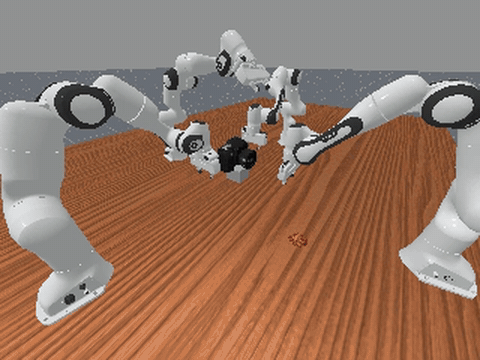
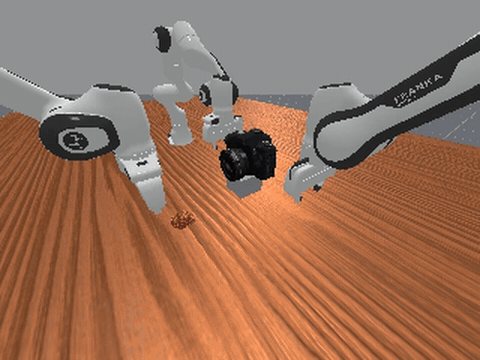
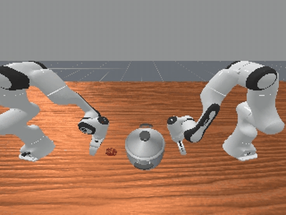
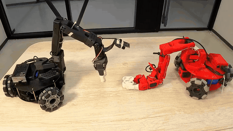
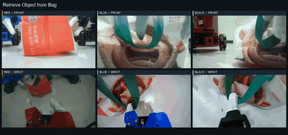
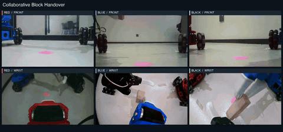

# WorldDreamer-V5-Lite

**The world’s first open‑source unified World‑Action Model (WAM) for multi‑robot collaborative control.**

  

## Overview

WorldDreamer-V5-Lite is a unified World-Action Model (WAM) for multi-robot collaborative control. It targets manipulation tasks that require multiple robots to coordinate their actions toward a shared goal.

We demonstrate collaborative manipulation in simulation and on real robots, covering coordinated camera operation, object placement, retrieval, and handover.

## Experiments

Click a preview to watch the full multi-view video. All previews play at original speed; real-world previews show short excerpts.

### Simulation

Collaborative manipulation tasks in [RoboFactory](https://iranqin.github.io/robofactory/).

| Video Preview | Task |
| --- | --- |
|  | **Take Photo**  Four robots coordinate to hold a camera, position the food, and press the shutter.  [Full video ↗](https://worldagents-c.github.io/worlddreamer-v5-project/assets/videos/take-photo.mp4) |
|  | **Camera Alignment**  Two robots lift the camera while a third positions the food in front of it.  [Full video ↗](https://worldagents-c.github.io/worlddreamer-v5-project/assets/videos/camera-alignment.mp4) |
|  | **Place Food**  One robot lifts the pot lid while another places the food inside.  [Full video ↗](https://worldagents-c.github.io/worlddreamer-v5-project/assets/videos/place-food.mp4) |

### Real-World Demonstrations

| Video Preview | Task |
| --- | --- |
|  | **Place Earbud in Case**  Two robots coordinate to place an earbud into its charging case.  [Full video ↗](https://worldagents-c.github.io/worlddreamer-v5-project/assets/videos/real-world/full/place_earbud_in_case_success.mp4) |
|  | **Retrieve Object from Bag**  Two robots hold the bag open while a third retrieves an object from inside.  [Full video ↗](https://worldagents-c.github.io/worlddreamer-v5-project/assets/videos/real-world/full/retrieve_object_from_bag_success.mp4) |
|  | **Collaborative Block Handover**  Three robots pass a wooden block between them and place it at the target.  [Full video ↗](https://worldagents-c.github.io/worlddreamer-v5-project/assets/videos/real-world/full/collaborative_block_handover_success.mp4) |
